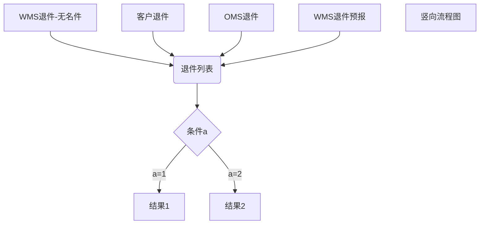

### 退件流程

> 1. -- 客户端-退件预报
> > - 推送WMS （com.szmsd.returnex.controller.ReturnExpressOpenController.expectedCreate）
> > - WMS接收到货，回调OMS （com.szmsd.returnex.controller.ReturnExpressOpenController.saveArrivalInfoFormWms）
> >    -销毁
> > ### 处理
>
